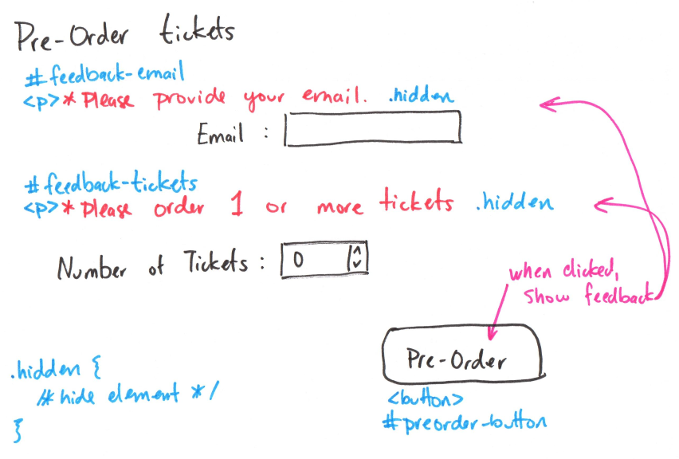

# Form Feedback Interactivity Planning

## _Planning_ Sketch(es)
> Include _planning_ sketch(es) of your form feedback interactivity.




### Pseudocode Plan
> Write your interactivity pseudocode plan here.
> Pseudocode is not JavaScript. Please do not put JavaScript code here.
> Reference each element's `id` in your pseudocode.

```
when #preorder-button is clicked:
  remove .hidden from #feedback-name
  remove .hidden from #feedback-email
  remove .hidden from #feedback-tickets
  remove .hidden from #feedback-location
```


## Form Feedback Interactivity Critique
> Explain how your form feedback interactivity design employs each interactivity design principle.

- Functionality

    It's confusing if the form is filled out incorrectly and the user doesn't know what they did wrong. The feedback messages provide the user with information on what they need to fix.

- Affordances

    The Pre-Order button is rounded and looks like a button which provide a clue to the user that they can click/tap it.

- Visibility

    The Pre-Order button is aligned to guide the user's eye through the form. When they complete the form, this action is the last thing they see.

- Feedback

    When the Pre-Order button is activated, the messages are immediately shown.

- Familiarity

    Many forms display feedback upon submitting a form. This design is similar.
